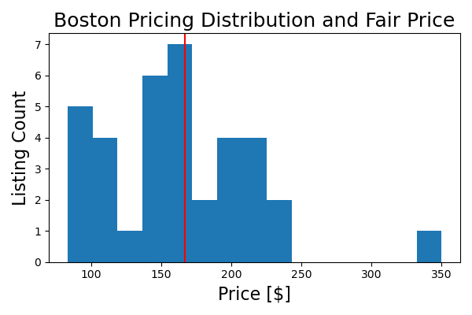

# Project : Boston Airbnb Fair Pricing Tool and Recommender
## Daniel Rossetti, Founder, Data Scientist for 'Cheap Stays, LLC'

# 1. Problem Statement
This report is written from the standpoint of an entrepreneur (Data Scientist and founder of Cheap Stays, LLC) looking to create a digital product which will help users quickly identify the fair price for an Airbnb which matches their desired criteria. It will also recommend Airbnb listings which match their criteria.

Airbnb is a popular website for those who travel for business or pleasure and need lodging but choose not to go the traditional hotel-route.  Usually, hosts offer-up their personal or secondary properties for people to stay at for a fee.  This fee may be cheaper than hotels while also providing the comforts of a furnished home depending on the type of listing.  Some individuals (hosts) will offer their dwellings as a source of passive income, and others have made Airbnb their main income stream.  Potential guests would likely find it beneficial to understand what constitutes a 'fair' price for an Airbnb given a set of desired criteria.  They would further be interested in seeing listings matching their input criteria at the same time.  Potential hosts may be looking to understand the current market for Airbnb listings similar to their own and would benefit from a pricing tool and similar listing recommender.

This project will seek to determine if an accurate fair-pricing tool can be developed to predict the prices of Airbnb listings in the Boston area while providing suggestions for currently listed Airbnb’s.  The accuracy of the pricing tool will be evaluated by the root mean squared error, and the target error will be approximately equal to $20 given that most Airbnb listings are listed in the low hundreds of dollars.

# 2. Project Approach
At a very high-level, Airbnb data are explored to determine how closely the features provided in the data correlate to either price or the logarithm of price.  Then features are engineered and also correlated to price and log price.  All features (original and engineered) are then used to train models based on how strongly they correlate with price and log price.  Different feature sets are created with different numbers of features and modeled against 7 different varieties of regression models.  Some optimization techniques are attempted and the best model is selected as the fair price recommender.  The recommender then uses similarity metrics to compare the desired characteristics of a user's Airbnb and output similar current listings.

## 2.1.  Code Notebooks (Notebook Directory)
There are six notebooks associated with this project.  A quick overview of each will be provided here:

* Notebook 1 - Exploratory Data Analysis.  Creates train, test, validation datasets, and performs simple EDA on numerical and categorical variables.  This excludes EDA on columns which require advanced preprocessing and feature engineering
* Notebook 2 - Feature Engineering Part 1.  Examines the features excluded from EDA and extracts or creates new features
* Notebook 3 - Feature Engineering Part 2.  Creates a feature loosely representing the distance from each listing to the nearest public transit (subway) stop obtaining additional data from the web
* Notebook 4 - Data Preprocessor and Compiler - Creates functions which perform all necessary transformation steps (previously performed in Notebooks 1, 2 and 3) to all datasets (training, validation, and testing)
* Notebook 5 - Modeling - Selects features based on correlation and creates price prediction models
* Notebook 6 - Recommender - Creates a near-prototype fair price and listing recommender tool

# 3. Description of Data and Exploratory Data Analysis
## 3.1. Airbnb Data (Notebook 1)
* "Inside Airbnb" is a database which regularly collects Airbnb listing data for multiple cities around the world.  The website can be accessed [here](http://insideairbnb.com/get-the-data/) by scrolling down to where Boston is listed
* The actual data was downloaded in the Boston section by clicking the '[listings.csv.gz](http://data.insideairbnb.com/united-states/ma/boston/2023-03-19/data/listings.csv.gz)' link
* The data dictionary can be accessed from the main webpage above and is located [here](https://docs.google.com/spreadsheets/d/1iWCNJcSutYqpULSQHlNyGInUvHg2BoUGoNRIGa6Szc4/edit#gid=1322284596)
* The listings.csv data, included in the above link, has 3864 total listings with 75 columns of data

The data were downloaded on 2023-05-30 and are from the most recent scraping dated 2023-03-19 on the Inside Airbnb website

Other data are sourced in Notebook 3 from the Massachusetts Bay Transit Authority (MBTA) Website and the Google Geocoding API.  Those sources will be discussed in greater detail in that notebook.

## 3.2 Supplemental Data (Notebook 3)
Supplemental data are gathered in an attempt to create features mimicking the distance between a listing's location and the closest subway stop.  Latitude and longitude data are provided for each listing from Inside Airbnb, and the subway stop locations were gathered via the following method:
* The [MBTA Stations](https://www.mbta.com/stops/subway) page was scraped to find all urls for all stations
* Station site was then scraped to find the station address
* The Google Geocoding API was then used to retrieve latitude and longitude for each address.  See the documentation [here](https://developers.google.com/maps/documentation/geocoding)

# 3.3 - Exploratory Data Analysis and Feature Engineering
Numerical and categorical features from the Airbnb data were examined.  Many of the features, such as the price, were exponentially distributed.  As a result of this, it was decided that EDA would focus primarily on correlations to price and log price, and in some cases, the logarithm of the features themselves were also calculated and correlated to price and log price.

Features were created from the more detailed text columns that were provided in the Airbnb data such as the listing name, amenities, description, etc.  Each of these were tokenized via some method to extract words or phrases that could be examined for correlation to price and log price.

# 4. Modeling / Recommender
## 4.1. Modeling Evaluation Metrics
The root mean squared error is the primary model evaluation metric as it would be expressed in the same units as the target variable, price.  This is a very tangible measure of how variable a model is simply because it outputs dollar amounts.

The R-squared value will act as a secondary metric to quickly evaluate the quality of the model itself and how much better (if at all, it is compared to the null model).

## 4.2. Pre-Modeling Feature Selection
Correlation coefficients were calculated between all engineered features and price/log_price.  Features with the highest magnitude correlations were then populated into feature sets which were used to generate datasets to train models.

## 4.3. Models and Optimization
Seven different varieties of regression models were implemented and run against all feature sets.  The best model was then selected and optimization and dimensionality reduction techniques were employed in an attempt to improve the model performances.  Additionally, a brief examination of poorly predicted and high-prices listings were performed.

## 4.4. Modeling Results
The best model was a random forest regressor set to default parameters.  It was only slightly better than the null model.

The most important modeling results are provided in the table below:
|                             | RMSE    | r2    |
|-----------------------------|---------|-------|
| Null Model, Training Data   | $208.33 | 0     |
| Null Model, Validation Data | $407.30 | 0     |
| Best Model, Training Data    | $138.88 | 0.556 |
| Best Model, Validation Data | $388.90 | 0.087 |

Additionally, model optimization techniques and dimensionality reduction techniques did not serve to improve the models and rather, made them slightly worse.

## 4.5. Recommender Results
A recommender was able to be created which would take user-input Airbnb criteria and produce a list and price distribution of similar listings currently on Airbnb.  The graphical output of this is shown below with the red line as the fair price prediction.

# 5. Discussion
The model appears to struggle with highly-priced listings.  These were quickly examined and it was ultimately determined that a much deeper study would be required in a subsequent phase of this project to understand the reasons for such poor predictions.  The plot below shows how these higher priced listings in the validation dataset affect the model RMSE by providing RMSE values for a given price limit (for both the training and validation sets) versus the pricing limit.

More domain knowledge and data could help to understand some of these more difficult listings and create features that will improve the model performance.  However, it is also possible that the provided data cannot accurately describe the prices which are set by very different people with their own personal and financial needs.  Additional study of the data is required to determine how much more information can be gained from it.

# 6. Conclusions
## 6.1. Fair Pricing Model Conclusions
* An Airbnb fair price predictor is able to be created, however, it's performance is almost negligibly better than the null model
* The best performing model was a random forest regressor with an RMSE on the validation data of \\$388.90 which is only slightly better than the null model of \\$407.30
    * The R-squared value of this model is 0.087
    * This is well beyond the problem statement target of $20
* This model struggle with very expensive Airbnb listings as removing these listings causes the model performance to improve
* Even with the effects of outliers minimized, the predictions are still highly variable
* Model optimization and dimensionality reduction techniques did not prove capable of improving the model performance
* Additional features must be created to see any significant improvements in model performance

## 6.2 - Recommender Conclusions
* A recommender system was able to be developed which would suggest a requested number of Airbnb listings based on user inputs
* The pricing model from the previous notebook was able to be utilized to provide a pricing estimate
    * Despite the poor performance of the model, it was still able to produce an estimate which seems reasonable based on the distribution of similar listings
    
# 7. Next Steps
## 7.1. Fair Pricing Model
* Perform an in-depth exploration of higher-priced listings, and poorly predicted listings from the validation dataset
* Explore the creation of the additional features based on the features that were not able to be included in this phase of prototyping.  These would include license, host neighborhood, and host location
    * Creating polynomial features is another technique that could be employed to predict prices
* Understand the impact that unsupervised learning techniques such as clustering may have on predictions by attempting to categorizing listings or hosts
* Continue to refine PCA
* Train a neural network regressor on the data and compare results
* Take all of the above improvements and attempt predictions on the testing dataset
* If possible implement the new model into the recommender

## 7.2. Recommender
* Incorporate a refined pricing model if one is able to be produced
* Create a full prototype by implementing this recommender in a Streamlit app